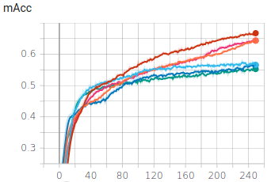
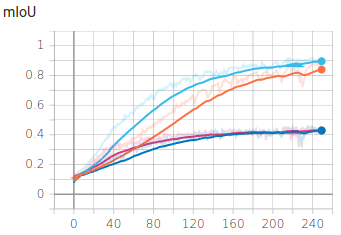

# Repository structure

The repository has the following structure:
  - Folder Scripts:
      - datas: class to read images from a CSV file
      - metrics: methods to calculate our metrics and show results.
      - transformations: classes and methods to be available the images and labels to be transformed
      - models: U-net model
      - utils: Other methods for miscellaneous goals, as save the current state of the model, select the colors to show labels.
  - Folder Experiments: Contains the model and checkpoints for each model evaluated on every experiment.
  - Folder Images: Zip file with all images and labels.
  - Model training: Google Colab to train the network.
  - Model testing: Google colab to load the model and test them.
  - Weights calculation: Google Colab to calculate the weights for the CrossEntropy weighted loss.
  - Tensorboard Unet Experiments: Google Colab to read results of previous executions.
  - Tensorboard Deeplab Experiments: Google Colab to read results of previous executions, when using Depplab Model
  - Data preprocessing: Google colab to read the dataset and generate images and labels for training, test and validation.
  - Model Deeplabv3-Resnet101: Training code adapt to use a pretrained model.

# About

  - Date: 17/11/2020
  - Authors: Xavier Riera, José Javier Gómez, Albert Mestre
  - Institute: Universitat Politècnica de Catalunya.

# Motivation

We decided to pursue an indoor image segmentation task, which is one of the key problems in the field of computer vision.

One of the main reasons we chose this topic is because we are interested in object detection and semantic segmentation, and after analyze the datasets available for free, we found a dataset available for semantic segmantation.

The architectures normally used in this field also caught our attention.

We were excited to learn the most about deep learning, its implementation, and observe how far our creativity can go to improve the performance of our model.

Besides learning about Deep Learning, we seeked to learn the most about working as a team on a project of this type.

# Proposal

  - Analyze and pre-process the data adapting it to the network.
  - Learn how to code a semantic segmentation neural network from scratch, with the help of existing papers of U-Net.
  - Mitigate the class imbalance to achieve a better performance of the model.
  - Know about how the different loss functions work.
  - Learn to implement the metrics to quantify the performance of the model.
  - Introduce to methods to reduce the overfitting, for example, using data augmentation and regularization techniques.

# Milestones

  - Obtain the NYU Depth V2 Dataset and preprocess it.
  - Implement the functions to calculate the metrics and the loss to evaluate the performance of the model during training.
  - Write the semantic segmentation U-Net network from scratch.
  - Train the network considering the class imbalance, using the metrics to backpropagate and update the weights.
  - Improve the performance of the network by changing the hyperparameters.
  - Generate the report, presenting the results obtained with its conclusions. 

# Computational resources

In this project we used Google Colaboratory, which is a free platform where the users can write text and code, so it is executed and saved in the cloud. We made a Google account to store the results of the experiments.

Google colaboratory assigns a random GPU when running, which it sometimes has different computing power. It is a Nvidia GPU, which specifications are described in the following image. There are also daily time limitations of execution of the GPU.

# Dataset

The NYU depth V2 dataset [1] contains a wide variety of indoor scene images captured by both the RGB and Depth cameras. It features 1449 RGB images, aligned with its label images and Depth images:

The depth images have not been used in this project. The raw images with its corresponding labelled images, which contain the ground truth of the object class for every pixel in the image, have been used to train, validate and test the network.

The size of raw images, which were captured by an RGB camera, is 640 x 480 x 3 channels. The size of the labelled images is 640 x 480 x 1 channel. Containing only the values of the object class for each one of the pixels.

This dataset had already defined the splitting of the dataset in training and test sets of images. The training and validation splits are generated randomly with proportionality 80% training and 20% validation using the given training split. The aim of that is to be able to compare the results and the performance of the network with other people who have used this dataset for the image segmentation task as well.

The splitting of the dataset is shown at the following table:

|            | Number of images | Percentage |
|------------|------------------|------------|
| Train      | 636              | 44%        |
| Test       | 654              | 45%        |
| Validation | 159              | 11%        |

### Interpretation of the dataset

By default, the objects labelled in the NYU Depth V2 dataset are classified in 894 different classes. To reduce the complexity of the project and achieve a better understanding of the dataset, a class reduction has been applied, grouping the 894 different classes in 13 classes, that contained more generalizing information of the objects. To grouping the classes a relation to convert 894 to 40 classes and 40 classes to 13 is given by the dataset. For example, the objects “shelf”, “wardrobe” and “desk” have been grouped into the class “furniture”.

In the following image we can observe the apparition of the different classes in the dataset, for train, validation, and test sets.

The labelled images in the dataset contain discrete values between 0 and 13, one for each object class, where the value “0” is assigned to those pixels which are not labeled.

We have adapted the labelled images values so they go between 0 and 12, and we also assigned to the “no label” pixels a value of 255 instead of 0.
 
Colorization of the labelled images has also been implemented in order to visualize the classes by looking the labelled image:

### Transformations applied to the dataset

A custom dataset class of the loading images and targets was created, in order to automatically resize them to fit them in the network, and also apply some data augmentation techniques.

Raw images have been resized to 300x300 pixels. Afterwards, we applied random crop to the train images and CenterCrop to validation and test images, so all the dataset have been transformed to 256x256 pixels.

This dataset class also applies some transformations like random cropping and center cropping used for data augmentation, controlling that the random is applied at same time for both the image and the target.

For data augmentation, we added some noise to the data and modified contrast, saturation and brightness, and also applied horizontal flip to the images, to try to improve the performance of the network and its generalization.

The values of the RGB images and its labels have been normalized to facilitate the training of the network, so all the values are between 0 and 1.

# Architecture

The architecture selected for our task is the U-Net, one of the most popular networks for computer vision, and specially for segmentation tasks.

This model was born in 2015 to solve image segmentation needs for biomedical applications [2]. It consist on a encoder, a bottleneck and a decoder and would be detailed at the paragraph “Disclosing the U-net”

Our model consists of using the U-Net to convert 256x256 RGB images to get a 256x256 pixels segmentation map of 13 categories. To accomplish that we follow the same structure, but adapt the steps of the original model to our needs. (Mainly modifying the convolutional part).

The main difference between U-net and other network architectures is that every pooling layer is mirrored by an up-sampling layer.
The mirror permits to reduce the size of the image in the encoder part, reducing the number of parameters that should be calculated.
For the previous reason, and also as the number of filters can be parallelized using GPUs is it possible to train the network fastly.
 
### Disclosing the U-NET

It is possible to define the U-net as a convolutional Encoder-Decoder architecture because it is made by an encoder, a decoder and a Neckbottle.

**Encoder**

The encoder part has the goal to obtain information about the input image. It is made by four convolutional blocks and four maxpooling steps.
Every Convolutional block is constructed by two blocks of Conv2D, BatchNormalization and ReLU as we can see on the following image:

The different elements of the Conv2D has the following goals:
  - Conv2D: Get information of the input image using different kind of filters.
  - Batch Normalization: Block to modify the layer, re-centering and re-scaling them to made faster and more stable.
  - ReLU: Discard negative values.

The maxpooling select the highest value of every 2x2 cell at the end of every convolutional block. The goal of maxpooling is to retain only the important features from each region and throw away non relevant information.

**Bottleneck**

The bottleneck block has the goal to force the model to learn a compression of the input data. The idea is that this model only learns relevant information to try to reconstruct the image.
The bottleneck is made by a convolutional block. It can also be used to represent the inputs with reduced dimensionality, because it contains all the information of the input image.

**Decoder**

The goal of the decoder is to predict the labels of the input image, using the information obtained by the Encoder and Bottleneck part.
The decoder is made by four unpooling blocks, four convolutional blocks, an optional dropout layer and finally a 2Dconvolution.

The elements of the Decoder part have the following goals:
  - Unpooling: Increase the size of the features, to try to recover a label with the same dimensions of the input image.
  - ConvBlock: Use the unpooling features and the higher resolution feature maps from the encoder network to reconstruct features. The feature maps from the encoder network help the decoder part generate reconstructions with accurate details.
  - Dropout: Ignore certain information to try to reduce overfitting problems.
  - Conv2D: Assign a pseudo probability for every input pixel to pertain to a certain class.

The output of the Conv2D of the last layer should have the same number of features of the number of classes that should predict.

# Loss functions

The loss function has the goal to measure how far the prediction of the network is with respect to the expected results.
The Cross Entropy is the simplest and most common loss function used in semantic segmentation. This loss examines each pixel individually, comparing the class prediction to our one-hot encoded target vector.

Mathematically is calculated using the following formule:

  is the target vector.
 is the softmax function calculated as:

 is the CNN score of the class 'i'

Due to the pixels that are not labeled in the target image can’t be predicted, they are not considered in this formula.

One of the problems of the Cross Entropy loss is the class imbalance of the dataset, because it learns better classes that appear more than classes that appear less.

To reduce this effect, it is possible use the "Weighted Cross Entropy" that consists of considering more relevant pixels that appear less. This relevance should have an inverse proportion with the number of pixels. For this reason it is necessary to analyze the number of pixels of each class in the training dataset:

To calculate the weights that should be used in the weighted loss we need to calculate the inverted frequency. These are the weights for our train dataset.

With this loss ideally it is possible to increase the mean intersection over union, but as it is explained on the experiments, it won’t improve them because the weights of the training are not the weights that maximizes the results of the validation dataset. One of the reasons is because of the size of the dataset, which is not so big.
Each weight is calculated as:

Where 13 is the number of classses

 is the number of pixels of class 'i'

These weights are used by the Cross Entropy loss to multiply the result by the correspondent factor.

# Metrics

Metrics are used in semantic segmentation to evaluate results of the training of the network. In our application the goal is maximize the metric called mean intersection over union.
By using the metrics, parameters of the model can be selected to maximize the needs of the application.
To evaluate the metrics, pixels that are not labeled on the ground truth are not considered.
The procedure to calculate the metrics in every epoch are the following one:
  - Every batch the values of pixel accuracy per class and intersection over union per class are calculated and stored in a dictionary.
  - Every epoch
     - Pixel accuracy per class is calculated averaging the pixel accuracy per class of every batch.
     - Mean pixel accuracy is calculated averaging the pixel accuracy per class of every epoch.
     - Intersection over union per class is calculated averaging the intersection over union per class of every batch.
     - Mean intersection over union is calculated averaging the intersection over union per class of every epoch.

**Pixel Accuracy per class**

Consist on evaluating for each class the percentage of pixels that are well labeled.
The pixel accuracy per class and per batch is calculated as:

 is the pixel accuracy on batch 'b' of class 'i'

 is the number of pixels of class 'i' of the batch 'b' well labeled

 is the number of pixels of class 'i' on batch 'b'

The pixel accuracy per class is calculated using the following formula:

 is the pixel accuracy of class 'i'

 is the number of batch that contains the class 'i'

**Mean pixel accuracy**

The mean pixel accuracy, as his name defines, compute the mean of the pixel accuracy of the classes calculated in the previous paragraph.
The formula used to calculate them is the next one:

**Intersection over union per class**

The intersection over union per class is calculated as the relation between the pixels well labeled of the class divided by the number of pixels predicted as the class and the number of pixels of the class that are not predicted.

Graphically is calculated as:

The intersection over union per class and per batch is calculated as:

 is the intersection over union on batch 'b' of class 'i'.

 is the number of pixels of class 'i' of the batch 'b' well labeled.

 is the number of pixels of class 'i' of the batch 'b' labeled as class 'i' but pertaining to other class.

 is the number of pixels of class 'i' of the batch 'b' labeled as other class but pertaining to class 'i'.

The pixel accuracy per class is calculated using the following formula:

 is the intersection over union of class 'i'.

 is the number of batch that contains the class 'i'

**Mean intersection over union**

The mean intersection over union, compute the mean of the intersection over union of the classes calculated in the previous paragraph.

This metric helps to reduce the effect of the class imbalance, for the following reasons:
  - Mean pixel accuracy doesn't consider the false positives, and therefore when the network has doubts about predicting the class tends to select one of the classes that appears the most.
  - In mean intersection over union, the classes with less apparitions have the same influence in the metric than classes with higher apparitions, due to the nature of the calculation of this metric. This makes it a good metric to evaluate unbalanced datasets, as is the case of the dataset in this project.

The formula used to calculate them is the next one:

# Experiments

We trained the model several times with different optimizers and hyperparameters, aiming to get the best Mean IOU. Which is the metric that best defines the performance of the results, as it is explained above. 

The main criterion to select which model is the best for our application is based on the simulation that gets the best mean IOU in any epoch of its simulation. Other factors can be taken into account, for example theoretical reasons or hardware limitations.

In every experiment the mean IOU, the Pixel Accuracy and the loss are graphically evaluated.

**Experiment 1: Adam learning Rate comparison**

The first hyperparameter evaluated has been the learning rate. The same optimizer has been used in both experiments, the Adam Optimizer.
The ADAM optimizer was selected to our model due to his adaptive gradient and his computacional efficiency.

In this experiment two of the typical LR for ADAM are compared:

  - Learning rate 1e-3
    -  Train
    -  Validation 
  - Learning rate 5e-4
    -  Train
    -  Validation 

Before the experiment theoretically we expect slightly better results in 5e-4 learning rate.

|                | ADAM LR 1e-3 | ADAM LR 5e-4 |
|----------------|--------------|--------------|
| Best epoch     | 165          | 191          |
| Mean IOU       | 41.09%       | 41.64%       |
| Mean Pixel Acc | 65.73%       | 67.27%       |

We observe that the one with learning rate 1e-3 converges faster, but slightly better results in metrics are obtained with learning rate 5e-4. 

**Experiment 2: Weight decay regularization**

The second parameter to evaluate is weight decay regularization.
Using the learning rate with the best IOU of the previous step (5e-4), we are going to simulate the difference between using Weight decay 1e-4 and not using it. 

  - Without using regularization
    -  Train
    -  Validation 
  - Using weight decay 1e-4
    -  Train
    -  Validation 

Before the experiment theoretically we expect reduce the gap between train and validation curves using regularization.

|                | ADAM Decay 0 | ADAM Decay 1e-4 |
|----------------|--------------|-----------------|
| Best epoch     | 191          | 216             |
| Mean IOU       | 41.64%       | 42.54%          |
| Mean Pixel Acc | 67.27%       | 67.50%          |

The  regularization does not reduce the overfitting effect but improves slightly the results obtaining an increment of IOU about 1%

**Experiment 3: Comparison between Optimizers**

The third experiment consists of evaluating a train between the best optimizer in the previous step (ADAM with Learning rate 5e-4 and weight decay 1e-4) with a SGD with momentum with similar conditions.

  - ADAM
    -  Train
    -  Validation 
  - SGD with momentum
    -  Train
    -  Validation 

Before the experiment theoretically we expect SGD with momentum has similar properties than ADAM but trains slower.

|                | ADAM Decay 0 | SGD with Momentum |
|----------------|--------------|-------------------|
| Best epoch     | 216          | 379               |
| Mean IOU       | 42.54%       | 30.60%            |
| Mean Pixel Acc | 67.50%       | 58.90%            |

Visualizing the graphics is easy to select ADAM as the best optimizer for the model. ADAM Optimizer is faster than SGD with Momentum, and due to this reason, when the system is trained with a limited number of epochs ADAM get better results.
For this reason, because the number of epochs due to restrictions of hardware and time to evaluate, we selected the ADAM optimizer although the IOU of the SGD continues increasing at the last epoch simulated.

**Experiment 4: Comparison between Dropouts**

The fourth experiment consists of trying to reduce the overfitting, putting a dropout stage before the last convolutional layer.

  - No Dropout
    -  Train
    -  Validation 
  - 0.2 Dropout
    -  Train
    -  Validation 
  - 0.5 Dropout
    -  Train
    -  Validation 

Before the experiment we expect dropout helps to reduce overfitting and therefore improve results with dropout.

|                | No dropout | Dropout 0.2 | Dropout 0.5 |
|----------------|------------|-------------|-------------|
| Best epoch     | 216        | 354         | 421         |
| Mean IOU       | 42.54%     | 42.59%      | 41.34%      |
| Mean Pixel Acc | 67.50%     | 68.58%      | 68.60%      |

A dropout with a probability p=0.5 (50%) does not increase the metric performance.
Instead, a dropout with a probability p=0.2 (20%) seems to get similar metric performance.
According to deep learning theory, the experiments with dropout should provide better results. Even though the results are very similar, we obtained slightly better results with dropout 0,2, so we kept this dropout in the following experiments.

**Experiment 5: Changing the loss function to try to reduce class imbalance**

As it is explained on paragraph "interpretation of the dataset" our dataset is imbalanced
During training, it is possible to appreciate that using standard CrossEntropy, classes that appear more in the dataset are learnt better than classes that appear less.
For this reason the following experiment consists of force to the system to attend more to classes that appear less on the images.
To do this experiment we are going to use the weighted loss explained in the $$"Loss functions"$$ paragraph

  - Standard Cross Entropy
    -  Train
    -  Validation 
  - Weighted Cross Entropy
    -  Train
    -  Validation 

Previous at the experiment we expect improve results on intersection over union, and reduce also the class imbalance, improving the results of classes with less apparitions on the dataset.

|                | Standard Crossentropy | Weighted Crossentropy |
|----------------|-----------------------|-----------------------|
| Best epoch     | 354                   | 302                   |
| Mean IOU       | 42.59%                | 40.99%                |
| Mean Pixel Acc | 68.58%                | 66.87%                |

The weighted loss does not improve the mean IOU. The explanation to that fact may improve the results in the ideal case that the distribution of categories in the training split were similar to the distribution of categories in the validation split.

The results of the IOU per class are the following:
  - Standard Cross Entropy

  - Weighted Cross Entropy

Despite the mean IOU is not better than not using weighted loss, we can see that the classes with less appearance have increased their IOU, and the classes more relevant have decreased.

**Experiment 6: Add noise**

To try to make the system more robust to different brightness levels, we added different random brightness, contrast and saturation.

To do that it is possible using a function called ColorJitter, that consist on add noise, modifying brightness, contrast and saturation randomly.

  - Without ColorJitter
    -  Train
    -  Validation 
  - With ColorJitter
    -  Train
    -  Validation 

 We expect improve the results adding random brightness noise to make the system more robust with different kind of noisy images.

|                | Without ColorJitter | With ColorJitter |
|----------------|---------------------|------------------|
| Best epoch     | 354                 | 348              |
| Mean IOU       | 42.59%              | 41.61%           |
| Mean Pixel Acc | 68.58%              | 68.70%           |

After the results, we can see as a conclusión that adding noise in our dataset doesn't improve the results, probably because the pictures are in similar brightness conditions 

Using colorJitter for data augmentation, stabilizes the loss in the validation split, but the results obtained in the metrics are worse.

**Experiment 7: Horizontal flip**

In the following experiment we are going to compare the results using horizontal flip or without using them.

  - Without Horizontal Flip
    -  Train
    -  Validation 
  - With Horizontal Flip
    -  Train
    -  Validation 

Interpretative to humans, we can detect the same objects if we have an image or if we have them with an HorizontalFlip.
For this reason it is reasonable that we can do a kind of data augmentation doing horizontal flip on training to try to decrease the overfitting.

|                | Without Horizontal Flip | With Horizontal Flip |
|----------------|-------------------------|----------------------|
| Best epoch     | 354                     | 414                  |
| Mean IOU       | 42.59%                  | 43.56%               |
| Mean Pixel Acc | 68.58%                  | 69.69%               |

As we expected, the results on validation are better using Horizontal Flip and also the loss and the metrics are stabilized.

# Reducing complexity of the model

After analyse the results of the experiments, several hypothesis are presented to improve the model, reduce overfitting, and maximize Intersection over Union (Iou) and Pixel Accuracy(Acc).

We conclude: 

  - Reduce the number of features could improve the overfitting.
  - A bigger size in bottleneck features could improve the metric results.

## Deep Dilated Unet

Our research was fructiferous and we obtain a paper Accuracy Improvement of UNet Based on Dilated Convolution from Shengyuan Piao and Jiaming Liu, from the University of Beijing, published at November, 2019. [3]

We show here the modificated Unet model proposed : Deep Dilated Unet with a Parallel Dilated Convolution bottleneck module.
 

As seen in this model, the number of skipconnections are reduced to 3. The module proposed as bottleneck consists in a 7 dilated convolutions.
Each one of them works with features from size 32x32x512. This is 512 features with mapping size of 32x32. The dilations rate increases quadratically, from 1 to 32.

To adapt this proposed Deep Dilated Unet, to our already implemented Unet working with our dataset, in addition with the quadratic rate convolutions,
we approach several prototypes. The problem we found is a trade off among skipconnections number, the number of convolutions in the bottleneck, and the number of channels and size of the features at the bottleneck. We start from RGB images at dataset from size 256x256x3.

**Experiment 8: Comparison between Deep Dilated Prototypes and Unet**

Prototypes developed : 

 

The prototype 1 (Deep Dilated Unet 1-16), has 3 skip connections, 5 dilated convolutions at the bottleneck which dilation rate is from 1 to 16, and features size 32x32x256.

The prototype 2, (Deep Dilated Unet 1-8) has 4 skip connections, 4 dilated convolutions at the bottleneck which dilation rate is from 1 to 8, and features size 16x16x512.

We train several models with the dataset and the hyperparmeters found by the Unet : Adam, Learning rate 5e-4, Weight Decay 5e-4, Dropout 0.2, HorizontalFlip. 

- Deep Dilated Unet 1-16
    -  Train
    -  Validation
 
- Deep Dilated Unet 1-8
    -  Train
    -  Validation 
- Unet
    -  Train
    -  Validation 

We got surprising results:  Prototype 1 (Deep Dilated Unet 1-16), with 3 skip connections, got better results than Prototype 2 (Deep Dilated Unet 1-8) with the four skip connections as our Unet model. But Unet model still has much more better results then the presented prototypes.

We concluded that we should improve prototype 1 (Deep Dilated Unet 1-16), because 3 skip connections is best than 4. But the clue is to have, for one side features with mapping space 32x32 with 512 channels at the bottleneck, at in the other side complete the 7 dilated convolution structure somehow.

Our research was fructiferous and we obtain a document with the final solution.
At the webpage Bitcoin Insider: Smart Audit: Using AI in International Trade. [4] we found the model prototype that inspired us to our final solution. 

This model has 3 skip connections, 6 dilated convolutions at the bottleneck which dilation rate is from 1 to 6, increased lineally, and features size 32x32x512 at the bottleneck.

The solution comes from two important changes

  - At the first convolution of the Unet, instead to produce feature maps of 32 channels, it produces feature maps of 64 channels. This results in features size 32x32x512 at the bottleneck 
  - Dilations rate increases lineally instead of quadratically. This give us the possibility to complete the Parallel Dilated Convolution bottleneck module from [3]

**Experiment 9: Comparison between Deep Dilated Unet and Unet**

Our Deep Dilated Unet developed :

Our Deep Dilated Unet model has 3 skip connections, 6 dilated convolutions at the bottleneck which dilation rate is from 1 to 6, increased lineally, and features size 32x32x512 at the bottlenck.

We train several models with the dataset and the hyperparmeters found by the Unet : Adam, Learning rate 5e-4, Weight Decay 5e-4, Dropout 0.2, HorizontalFlip. 

- Deep Dilated Unet

    -  Train
    -  Validation 

- Unet

    -  Train
    -  Validation 

    
The results shown there is still overfitting. But we got a quite significally increase of the Intersection Over Union (mIoU) and Pixel Accuracy (mAcc).

|                | Deep Dilated Unet   | Unet    |
|----------------|---------------------|---------|
| Best epoch     | 220                 | 414     |
| Mean IOU       | 45.70%              | 43.56%  |
| Mean Pixel Acc | 71.40%              | 69.69%  |

## Attention Unet

After analyse the results of the experiments, several hypothesis are presented to improve the model, reduce overfitting, and maximize Intersection over Union (Iou) and Pixel Accuracy(Acc).

We conclude: 

  - Reduce the feature's size could improve the overfitting.
  - An attention mechanism in the Unet could improve the metric results.

To implement the reduction size of features, we are gonna construct an array filters like this :

        filters = [32, 64, 128, 256, 512]
        filters = [int(x / feature_scale) for x in filters]

The parameter feature_scale will affect the size of the filters. Passed to the model, it will build one with reduced size in features model.        
        
We encounter, that 
  - For our classic Unet model, the overfitting is significantly reduced with feature_scale = 4.
  - For the Deep Dilated Unet model, the overfitting is significantly reduced with feature_scale = 8.

Our research was fructiferous and we obtain a paper Attention U-Net: Learning Where to Look for the Pancreas from Ozan Oktay and others. [5]

We show here the modificated Unet model proposed : Attention U-Net with attention gate (AG) unit. [5]

The implementation is adapted from the code Attention Gated Networks (Image Classification & Segmentation) [6]. We reuse and adapt some python code modules.

**Experiment 10: Comparison between Unet, Attention Unet and Deep Dilated Unet**

In the following experiment we are going to compare the results using feature_scale, attention at skipconnections and dilated convolutions at bottleneck.

We train several models with the dataset and the hyperparmeters found by the Unet : Adam, Learning rate 5e-4, Weight Decay 5e-4, Dropout 0.2, HorizontalFlip.

- Unet. feature_scale = 4

    -  Train
    -  Validation

- Attention Unet. feature_scale = 4

    -  Train
    -  Validation 
    
- Deep Dilated Unet. feature_scale = 8

    -  Train
    -  Validation 

The results shown there is much less overfitting with feature_scale parameter. 
We got a a better results in overfitting with Attention Unet, since validation loss and training loss are close in more epochs. But instead we observe better performance in Intersection Over Union (mIoU) and Pixel Accuracy (mAcc) metrics with Deep Dilated Unet. We observe a peak in metrics that gives Attention Unet to overpass Deep Dilated Unet at the last epochs in simulations.

|                | Unet       | Attention Unet | Deep Dilated Unet|
|----------------|------------|----------------|------------------|
| Best epoch     | 248        | 239            | 232              |
| Mean IOU       | 20.93%     | 22.07%         | 21.38%           |
| Mean Pixel Acc | 56.96%     | 55.26%         | 57.97%           |

**Experiment 11: Comparison between Attention Unet and Attention Deep Dilated Unet**

In the following experiment we are going to compare the results using feature_scale, and Attention Unet single model with Attention + Deep Dilated Unet combined model. 

We train several models with the dataset and the hyperparmeters found by the Unet : Adam, Learning rate 5e-4, Weight Decay 5e-4, Dropout 0.2, HorizontalFlip.

  - Attention Unet. feature_scale = 4
  
    -  Train
    -  Validation 

  - Attention Deep Dilated Unet . feature_scale = 8
  
    -  Train
    -  Validation 

The results shown there is much less overfitting with feature_scale parameter. 
We got a better results in overfitting with Attention Unet, since validation loss and training loss are close in more epochs. But instead we observe better performance in Intersection Over Union (mIoU) metric with Attention Deep Dilated Unet combined model. Instead Pixel Accuracy (mAcc) metric has been reduced compared with a  Deep Dilated Unit single model.

|                | Attention Unet    | Attention Deep Dilated Unet |
|----------------|-------------------|-----------------------------|
| Best epoch     | 239               | 242                         |
| Mean IOU       | 22.07%            | 22.22%                      |
| Mean Pixel Acc | 55.26%            | 56.09%                      |

**Experiment 12: Comparison between Deep Dilated Unet and Attention Deep Dilated Unet at original scale**

In the following experiment we are going to compare the results using feature_scale=1 ; this means at the original scale.
The models to compare are Deep Dilated Unet single model with Attention + Deep Dilated Unet combined model. 

We train several models with the dataset and the hyperparmeters found by the Unet : Adam, Learning rate 5e-4, Weight Decay 5e-4, Dropout 0.2, HorizontalFlip.

  - Deep Dilated Unet
  
    -  Train
    -  Validation 

  - Attention Deep Dilated Unet
  
    -  Train
    -  Validation 

The results shown very similar results with differences:
There is better response at reducing overfitting with Attention Deep Dilated Unet combined model, since validation loss and training loss are close in more epochs. We observe a faster convergence in loss at training and validation final values.
We got a similar results at performance in Intersection Over Union (mIoU) and Pixel Accuracy (mAcc) metrics in both models. Pixel Accuracy (mAcc) metric has some improvement in the Attention Deep Dilated Unit combined model.

|                | Deep Dilated Unet | Attention Deep Dilated Unet |
|----------------|-------------------|-----------------------------|
| Best epoch     | 220               | 212                         |
| Mean IOU       | 45.70%            | 45.11%                      |
| Mean Pixel Acc | 71.40%            | 71.76%                      |

# Pretrained model : DeeplabV3-RESNET101

**Experiment 13: Comparison between Optimizers**
In the following experiment we are going to compare the results using a pretrained Network, using two different optimizers.

  - ADAM LR 1e-3 WD 1e-4
  
    -  Train
    -  Validation 
    
  - SGD LR 1e-3 WD 1e-4 
  
    -  Train
    -  Validation 

We expect increase results because the network was pretrained with a huge Dataset.

|                | ADAM   | SGD    |
|----------------|--------|--------|
| Best epoch     | 193    | 195    |
| Mean IOU       | 45.94% | 56.44% |
| Mean Pixel Acc | 72.74% | 80.83% |

As we expected, the results on validation are better using a model pretrained with a huge dataset than a small dataset.

Surprisingly for ours, SGD configuration has significantly better results than ADAM.

# Conclusions

After select the best model as the best mean intersection over union of all experiments, we can see the following results in testing:

  - Mean IOU: 34.09%
  - Mean Pixel Accuracy: 62.76%

Example of qualitative results:
  - Input image

  - Ground through
  

  - Prediction

At the end of all of the project, all of the experiments and the qualitative results, we learn the following performances about deep learning:
  - Is posible train a net without invest money on GPU, thanks to Google Colab.
  - Data is all, having good results depends on the amount of data and its treatment.
  - Most of the time to program a network is to process the data and wait for training results.
  - Know metrics goals before start the net helps to modelate the parameters of the network.
  - Dropout: better results but less improves than we expect.
  - Intuitively the model learns better classes that are easy to differentiate for humans 
  - Human logic helps to select transformations to our system.

# References
[1]: NYU depth V2 dataset. https://cs.nyu.edu/~silberman/datasets/nyu_depth_v2.html

[2]: Olaf Ronneberger, Philipp Fischer, Thomas Brox. "U-Net: Convolutional Networks for Biomedical Image Segmentation". CVPR, 2015. https://arxiv.org/abs/1505.04597

[3]: Accuracy Improvement of UNet Based on Dilated Convolution. https://iopscience.iop.org/article/10.1088/1742-6596/1345/5/052066

[4]: Bitcoin Insider: Smart Audit.Using AI in International Trade. https://www.bitcoininsider.org/article/48604/smart-audit-using-ai-international-trade

[5]: Attention U-Net: Learning Where to Look for the Pancreas. Ozan Oktay and others. https://arxiv.org/abs/1804.03999

[6]: Attention Gated Networks (Image Classification & Segmentation). https://github.com/ozan-oktay/Attention-Gated-Networks